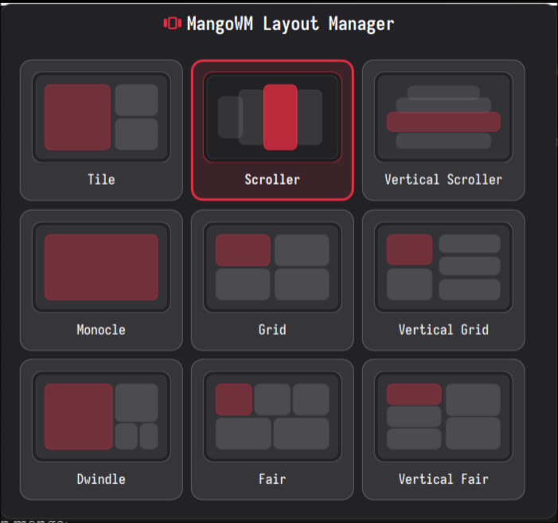

# MangoWM Layout Manager

A simple DMS widget for switching the active MangoWM layout from the bar.

## Dependency

This plugin requires MangoWM's IPC helper:

- `mmsg`

The widget uses:

- `mmsg get monitor <name>` / `mmsg watch monitor <name>` to read the current layout
- `mmsg dispatch setlayout,<layout>` to switch layouts

## Supported Layouts

The chooser ships with the layouts documented by MangoWM at:

- https://mangowm.github.io/window-management/layouts/

Included layouts:

- `tile`
- `scroller`
- `monocle`
- `grid`
- `deck`
- `center_tile`
- `vertical_tile`
- `right_tile`
- `vertical_scroller`
- `vertical_grid`
- `vertical_deck`
- `dwindle`
- `fair`
- `vertical_fair`

## Install

Copy this directory into:

- `~/.config/DankMaterialShell/plugins/DMSMangoWMLayoutManager`

Then restart DMS and enable the plugin in the Plugins settings tab.

## Notes

- Layout changes are applied through MangoWM's currently focused context.
- If `mmsg` is missing or MangoWM is not running, the widget shows an unavailable state.
